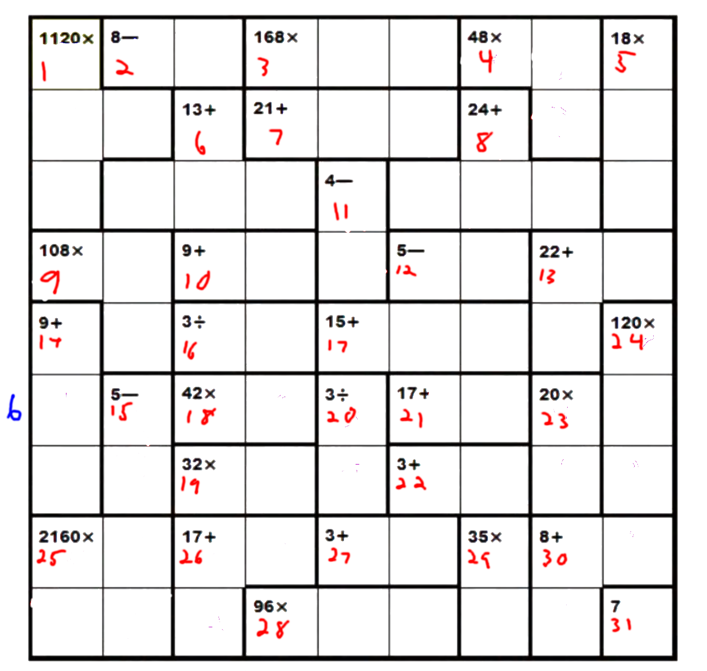
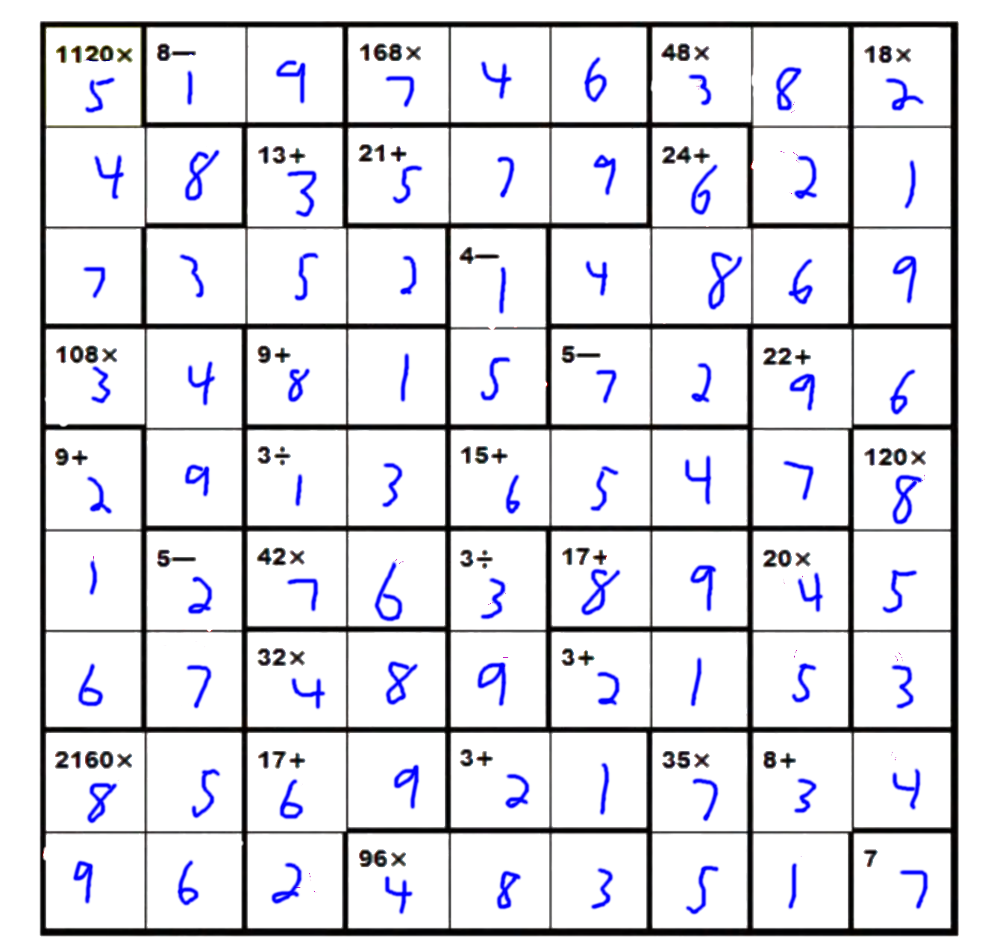

# Z3 Math Sudoku

A heavily modified + stripped-down version of [@awkwardbunny](https://github.com/awkwardbunny)'s awesome [Z3 sudoku solver](https://github.com/awkwardbunny/z3-sudoku).

I tailored the solver to solve the following "math sudoku":

*(The red numbers are for my own reference, blue marks row 6)*

where the generated solution is:

The majority of the work was done by [@awkwardbunny](https://github.com/awkwardbunny); please check out his repo for more info!!!
My modification was just done as a one-off to help a friend get a bonus point, and I figured I'd upload my changes in case anyone was interested :)